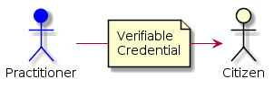
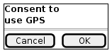
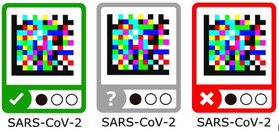

toc:

# Immunisation and collective knowledge in pandemia management

## Introduction

To help in times of virus crisis (eg. corona) and for social recovery after the initial crisis, this application uses [Verifiable Credentials](https://en.wikipedia.org/wiki/Verifiable_credentials) (VCs) to associate immunisation & health information to citizens.
We use VCs to **increase privacy** and data control by the user, compared to the equivalent centralized applications developed in other regions like China or Korea. In addition, VCs improve the **interoperability** and usage of this data **across borders in the European Union** (and with other regions with proper agreements), **without requiring a centralized repository**.

The application uses [EBSI](https://ec.europa.eu/cefdigital/wiki/display/CEFDIGITAL/EBSI) as a public decentralized registry to check the validity of the public identities of practitioners and other professionals and institutions that may be involved. In addition, the application can be configured to verify public identities against any other publicly accessible blockchain repository (like Alastria Red T) with compatible query interface (or even centralized systems, with the condition that they be trusted).

Most interactions among participants happen **off-chain** with high levels of privacy, scalability and flexibility. However, the citizen can provide **explicit consent** in the form of VCs to enable the application to send some specific information to the health authorities of each country.

In addition, the application can:

- Provide **information to health authorities** to make better operational decisions through higher levels of traceability of the health status of citizens, including vaccines and vaccination procedures.
- Use **color coded schemas for social interactions** to provide information to improve protection and prevention of people during an epidemic or pandemic situation. Color coding can be more sophisticated than current schemes, thanks to the use of VCs.
- Use exactly the same mechanism to deliver to the citizens other useful credentials during the post-crisis recovery of the society, for example **temporary permits** for going to work, visiting family or travelling, both inside a country and across borders.

## High level overview

### Practitioners can issue credentials to Citizens

Health practitioners will issue to citizens different types of health status situation reports as special Verifiable Credentials. The credentials issued by practitioners will be based on lab tests, vaccination, diagnostics, etc.

The health condition credentials are tied to the digital identity of the issuing party. In case of practitioners this should be tied to their professional credentials, which are public and issued by the corresponding official entities (the process may depend on the specific country). All data exchanges are accompanied by a GDPR consent encoded as Verifiable Claim so that legitimate use of the data can be proved.

The system allows practitioners to issue credentials to citizens directly, just using their mobile phones while on the field, for example.

### Citizens can present their credentials to officials

Communication is in general P2P (app-2-app), achieving very high levels of privacy. It includes the ability to use a simple QR based system for sending/receiving VCs to enable simple phone-to-phone verification of a credential without previous relationship among the participants. For example, when a citizen is walking in the street and an official has to verify that the citizen has the corresponding permit. The citizen can just display the QR representing the VC and the official can scan the QR and verify it.

This behaves in much the same way as paper credentials but in a much more secure and convenient way.
Except that health conditions can change a lot with time, so these health condition credentials will be regularly updated and timestamping will determine which is most recent. For each latest health condition credential, a QR can be generated by the citizen using a smartphone and this code can be read by another smartphone, either a practitioner, an official or other citizen. **No physical contacts or pre-established relationship** among parties are needed. These QRs are destroyed (as they are only digital, this means that they will not resolve any information) when a new health condition credential is created.

### Citizens can self-attest their health status using questionnaires

Citizens can self-attest their health status using questionnaires, in a similar way that is done now with some apps developed in some countries for coronavirus crisis management. These credentials are of a different nature, being self-issued and not fully verified by an authority, but they have proven to be of immense value in times of crisis. A simple verification with the mobile number, even if not legally binding, can be very useful in these situations.

### Citizens can provide consent to use personal data

Citizens can provide consent to use personal data embedded in the credentials, including the GPS coordinates in their phones for different purposes, which can range from full tracking to explicit geo-tagging of some VC when the citizen considers it adecuate (for example for self-attestation of compliance with quarantine). Some messages can be automatically collected in a central server (there may be one per country depending on the citizen), and the aggregated information from many citizens can be used and analyzed.

### Color coding in a safe and privacy-preserving way

The information represented by these Verifiable Credentials can be used in a safe and privacy-preserving way for things like "color coding" citizens for their health condition regarding the infection status and places visited.

## Main system characteristics

- Integrated with EBSI (European Blockchain Services Infrastructure) and reusing the ESSIF components, where EBSI will have a global public registry of official health institutions (similar to the registry for Universities). The EBSI registry should be accessible externally by anybody in read mode, to verify the public identities of the health institutions. However, the application can be configured to work using any other blockchain network with compatible interfaces. Additionally, the application can reuse many of the components already available for the Diplomas use case in EBSI.

- In an initial phase of the application, it is not strictly necessary that the citizens have an official identity issued by the government (ESSIF). For crisis management it could be enough that they self-issue a DID which is then used in the credential issued by the practitioner when performing the test or vaccination procedure to the citizen.

- Credentials are stored in-app except practitioner credentials representing their identities, which are stored in a public registry. Stale/old data is deleted.

- An interactive and patient focused e-consent system will be included in order to ensure the highest consent rate possible, integrated with the health status credentials.

- Citizen data is only read by practitioners, not stored (equivalent of showing a piece of paper, but not copying it).

- The important exception being the case for government data analysis, for crisis management purposes.

!!! note
    This project is heavily inspired by the [healthcrisis](https://github.com/disposableidentities/healthcrisis) initiative, but it has been adapted to leverage ESSIF and in general the existing EBSI infrastructure and components.

