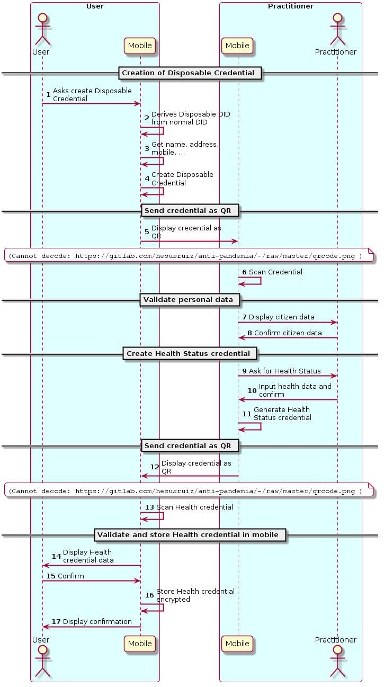

# Issuing credentials

## Practitioner issuing Health Credential

In this interaction, the citizen is in physical contact with a practitioner and receives a Health Status credential, exchanging QRs as the communication mechanism.
This mechanism allows the issuance of credentials by a natural person without requiring a established relationship beforehand.

1. The user creates a self-issued credential and sends it to the practitioner
2. The practitioner checks personal data (name, address, mobile)
3. Practitioner creates health status credential and sends it to citizen
4. Citizen stores health status credential in her mobile

## Institution issuing credential

(TBD)