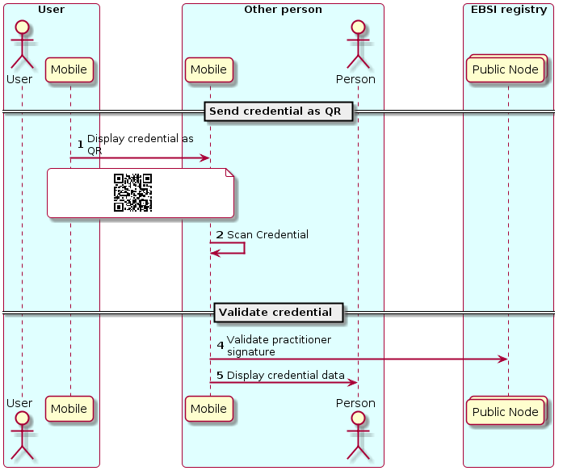

# Verifying credentials

## By a natural person

In this interaction the citizen can send a Health Status Credential to any other actor, who can verify the signature of the practitioner against the public registry of practitioner identities in the blockchain.
The credential can be sent to a practitioner, an official or another citizen.

The process of validation of the practitioner signing the citizen's credential involves checking the signature against both the repository of signatures of practitioners and also the repository of entities attesting the identities of practitioners.

## By an institution

(TBD)